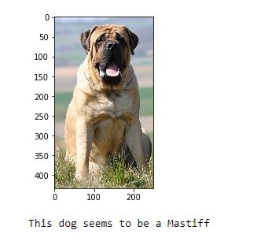

# Dog Breed Classifier using CNN in PyTorch

For software requirements: see "requirements.txt" file.

**Udacity's original repo is [here](https://github.com/udacity/deep-learning-v2-pytorch/tree/master/project-dog-classification)**

## Project Introduction

In this project, you will build a dog breed classifier pipeline that can be used within a web or mobile app to identify dog breeds in real time.  
Given an image of a dog, your algorithm will  identify an estimate of the canine’s breed.  
If supplied an image of a  human, the code will identify the resembling dog breed.  

We will work on a CNN from scratch as well as apply transfer learning to use state-of-the-art CNN architectures.  

The datasets can be downloaded here:
[dog dataset](https://s3-us-west-1.amazonaws.com/udacity-aind/dog-project/dogImages.zip)   
[human_dataset](https://s3-us-west-1.amazonaws.com/udacity-aind/dog-project/lfw.zip)  

## CNN Structures (Building a model from scratch)

Net(  
  (conv1): Conv2d(3, 32, kernel_size=(3, 3), stride=(2, 2), padding=(1, 1))
  F.relu()
  (pool): MaxPool2d(kernel_size=2, stride=2, padding=0, dilation=1, ceil_mode=False)
  
  (conv2): Conv2d(32, 64, kernel_size=(3, 3), stride=(2, 2), padding=(1, 1))
  F.relu()
  (pool): MaxPool2d(kernel_size=2, stride=2, padding=0, dilation=1, ceil_mode=False)
  
  (conv3): Conv2d(64, 128, kernel_size=(3, 3), stride=(1, 1), padding=(1, 1))
  F.relu()
  (pool): MaxPool2d(kernel_size=2, stride=2, padding=0, dilation=1, ceil_mode=False)
  
  (drop): Dropout(p=0.3)
  (fc1): Linear(in_features=6272, out_features=512, bias=True)
  F.relu()  
  (drop): Dropout(p=0.3)  
  (fc2): Linear(in_features=512, out_features=133, bias=True)  
  F.relu()  
)  
-----    

-	Accuracy achieved on this model is **13%**  

## Transfer Learnings

Then we used InceptionV3 for Transfer Learning
See the well 'dog_app.ipynb' for instructions.  

- Accuracy achieved after transfer learning is **85%**

## Results  

## Happy Coding!
